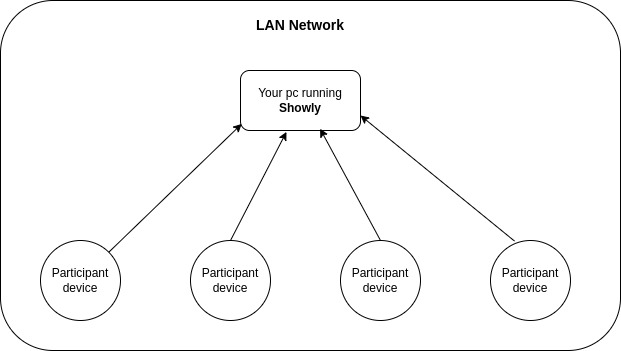

<div style="display:flex; flex-direction:row; justify-content:center; align-items:center; align-content:center; justify-items:center; width:100%;">
    
</div>

# Showly desktop

Showly is an app to display your slides to other people if you do not have large
screens or projectors to show it easily. Showly desktop supports Linux and Windows,
it has not been tested on MacOS yet.

## How it works

When you run Showly desktop you will need to be connected to a LAN network, so
your slides can be shared through that network. All participants of your
talk will connect to the showly instance that is running on your pc using their
web browsers on their pc or smartphones and they will see every single slide on it.

The following diagram shows how it would be:

<div style="display:flex; flex-direction:row; justify-content:center; align-items:center; align-content:center; justify-items:center; width:100%;">
    
</div>

## How to run

To run Showly desktop you will need to have [JDK 17](https://jdk.java.net/archive/) installed
on your system. You can check if you have the correct JDK version running:

```sh
java --version
```

Then you have to download the latest version of Showly desktop from the [releases page](https://github.com/R0land013/showly-desktop/releases).
Now, to run the program you have to open your Terminal in the same directory where
you downloaded the showly app and execute the following command:

```sh
java -jar name_of_the_file_you_downloaded.jar
```

If you have configured your system to open **.jar** files, then you could open the program
double clicking the .jar file.

## Troubleshooting

if the participants of your talk are unable to see the slides on their web browsers you
can try these things to fix the problem:

- Assert that the showly process is showing the slides.
- Check you are connected to the same LAN network as your participants.
- Assert the showly program is allowed through your firewall.
- Check the port you are using to run showly is allowed through your firewall.

## Contribute and Development

Showly desktop is a GUI wrapper of [showly package](https://github.com/R0land013/showly), so if
you are a developer and want to make your own Showly GUI, you are able to do it wrapping that
package as I did.

The requirements of this project are:

- [Maven 3.8.8 or higher](https://maven.apache.org/)
- [JDK 17](https://jdk.java.net/archive/)

If you wish to contribute with new features, ideas and bug fixes you can always open an issue.

To run this project you have to execute the next command:

```sh
mvn javafx:run
```

To package this as a .jar file execute:

```sh
mvn compile package
```

The output .jar file will be in `./target/shade` directory.

## License

This project is under [MIT LICENSE](/LICENSE).

## Contact

You can find my contact info [here](https://r0land013.github.io/).
